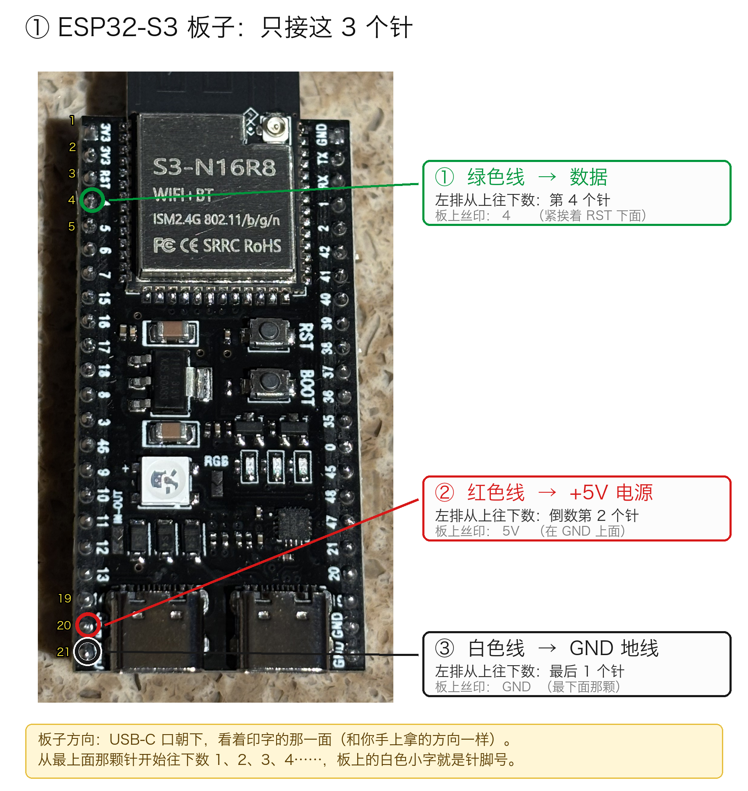
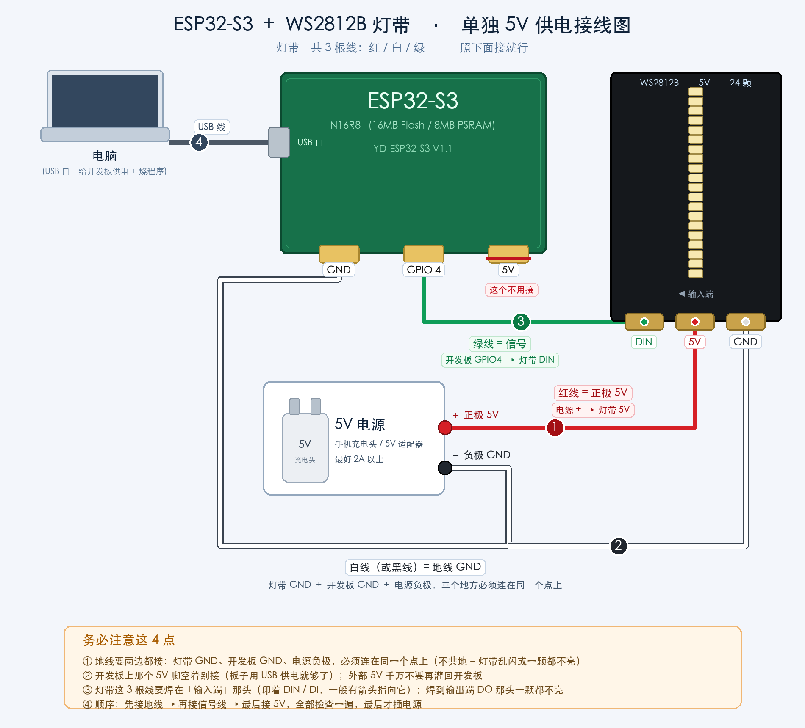
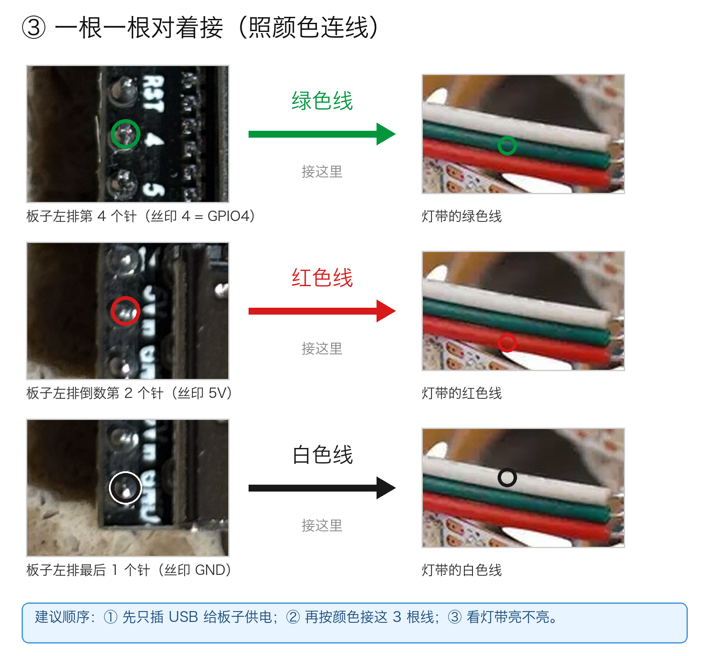
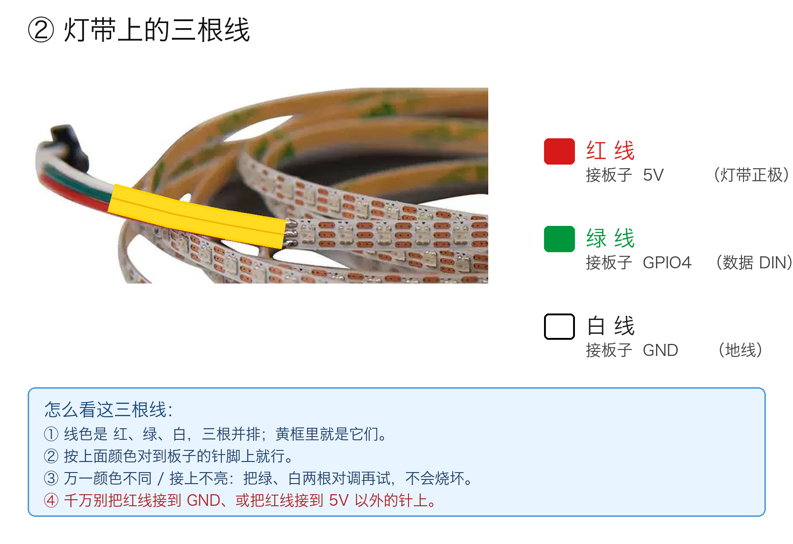
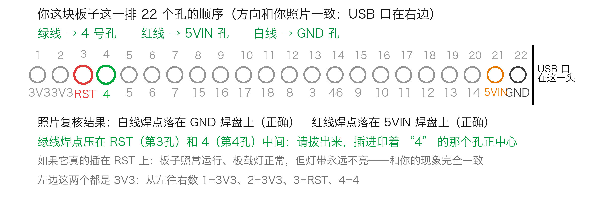
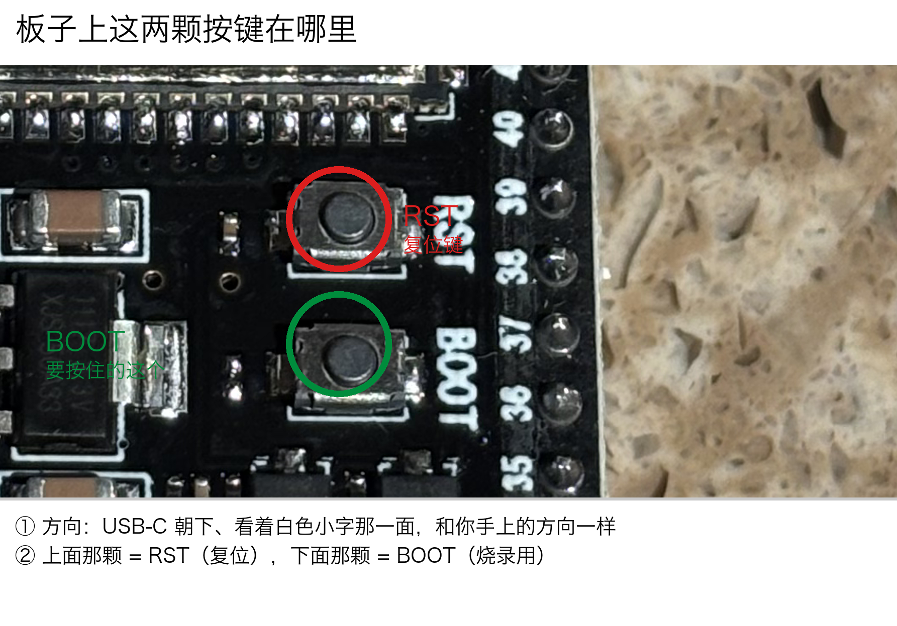
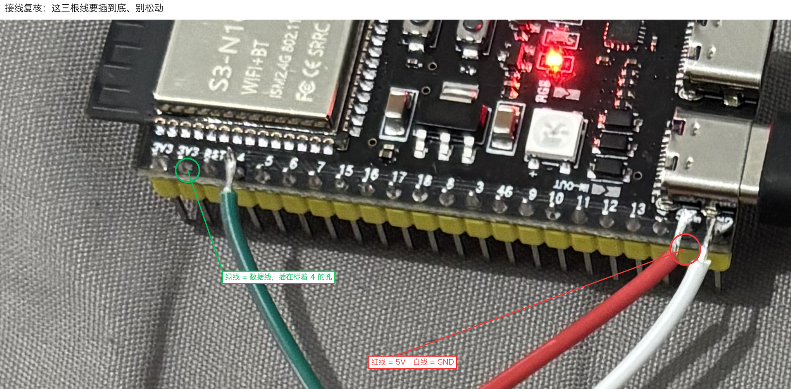
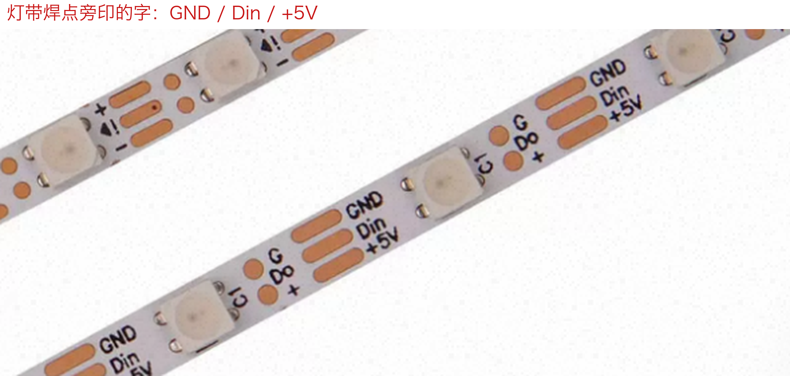
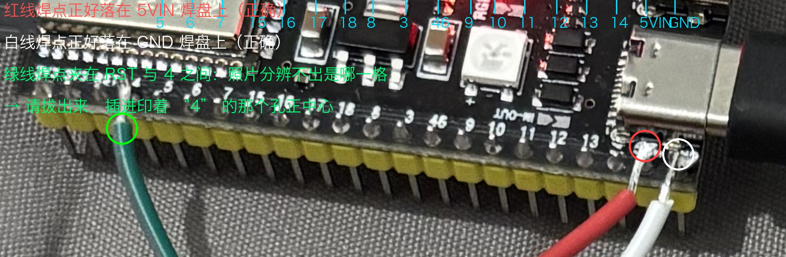

# 接线图

按顺序看。**先看 ① 和 ⑨**，这两张能把 90% 的问题挡掉。

---

## ① 板子接线位置 —— 只接 3 个针

左排从上往下数：第 4 针 = 数据（板上丝印 `4`）、倒数第 2 针 = `5V`、最后 1 针 = `GND`。
**看印字的那一面，USB-C 口朝下**，跟手里拿着时的方向一致。

> 板子上白色小字就是针脚号，不用记——对着数一遍就够。

---

## ⑨ 独立 5V 供电接线图（最重要的一张）

灯带一共 3 根线，照这个接：

| 线 | 接到哪 |
| --- | --- |
| 绿（信号） | 开发板 `GPIO 4` → 灯带 `DIN` |
| 红（+5V） | **外部 5V 电源正极** → 灯带 `5V` |
| 白 / 黑（GND） | 灯带 `GND` + 开发板 `GND` + **电源负极**，三个点必须连在一起 |

**四条铁律：**

1. **地线要三边都接**（灯带 GND、开发板 GND、电源负极，同一个点）。
   不共地 = 灯带乱闪或者一颗都不亮。
2. **开发板上那个 5V 脚空着别接**——板子用 USB 供电就够了，外部 5V 千万别倒灌回开发板。
3. 灯带的 3 根线要焊在**「输入端」**那头（印着 `DIN` / `DI`，一般有箭头指向它）。
   焊到输出端 `DO` 那头，一颗都不亮。
4. **顺序**：先接地线 → 再接信号线 → 最后接 5V，全部检查一遍，最后才插电源。

> 短灯带（≤ 24 颗、≤ 1.4A）才可以直接从开发板 5V 脚取电；这个工程是 67 颗，必须独立供电。

---

## ③ 整体连接关系

---

## ② 灯带那头三根线长什么样

---

## ⑧ 排针顺序对照表

数不清第几针的时候对着这张表数。

---

## ④ 板子上两个按键（RST / BOOT）

烧录卡住、或者板子进不去下载模式时用：**按住 BOOT → 点一下 RST → 松开 BOOT**。

---

## ⑤⑥⑦ 实拍复核（这一台自己的照片）

这三张是这个具体工程的实拍和核对标注，留着当参考，不用照抄位置。

⑥ 这张是确认**灯带是 5V 版本**——丝印上写着电压。买错成 12V 版本的话，
按 5V 供电是一颗都不会亮的，而且这种错光看代码永远查不出来。
